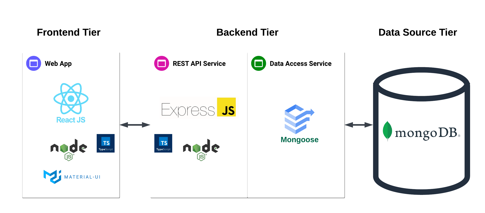
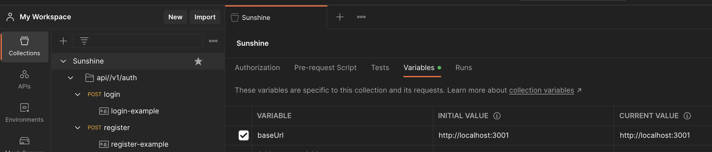
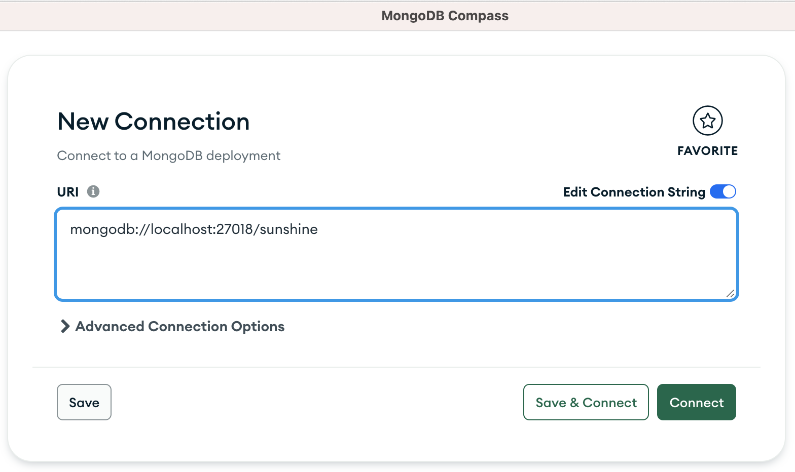

# 🌞 SUNSHINE (Backend)

See the application structure in the image below:


This is the Backend application.
For the Frontend application, please go to [https://github.com/leogomesdev/sunshine-frontend](https://github.com/leogomesdev/sunshine-frontend)

## 📚 Description

This project provides APIs for the frontend application.

## 📲 Main technologies used

- [Express](https://expressjs.com) version 4, a minimalist web framework for Node.js
- [MongoDB](https://www.mongodb.com) as database
- [Mongoose](https://mongoosejs.com) for database connection
- REST API
- [TypeScript](https://www.typescriptlang.org), JavaScript with syntax for types
- [Jest](https://jestjs.io) for unit tests
- [Commitizen command line tool](https://github.com/commitizen/cz-cli)
- [Conventional Commits specification](https://www.conventionalcommits.org/en/v1.0.0/)

## 💡 Requirements

### 💻 For local usage:

- [Node.js](https://nodejs.org) (v18)
- [npm](https://www.npmjs.com)
- [MongoDB](https://mongodb.com) database. Highly recommended to [Deploy a Free Cluster at MongoDB Atlas](https://www.mongodb.com/docs/atlas/tutorial/deploy-free-tier-cluster)

## 🚀 Running

### 🐳 Using Docker

- Install [Docker Desktop](https://docs.docker.com/desktop)
- Clone both repositories: [sunshine-frontend](https://github.com/leogomesdev/sunshine-frontend) and [sunshine-backend](<(https://github.com/leogomesdev/sunshine-backend)>)
- Access the root folder for one of the projects
- Run:
  ```bash
    docker-compose up
  ```
- This command will create and run 3 containers:
  - db: a MongoDB local instance
  - api: the sunshine-backend project
  - app: the sunshine-frontend project

### 💻 Locally

- Be sure to install the [requirements](#requirements)

  - If you have [nvm - Node Version Manager](https://github.com/nvm-sh/nvm) installed, you could just run `nvm install` and it will install the correct version of Node.js based on file `.nvmrc`

- Create the .env file:

  ```bash
    cp -v .env.example .env
  ```

- Edit the .env file to provide the required environment variables.

- Install dependencies:

  ```bash
    npm install
  ```

- Start the application:
  ```bash
    npm run start
  ```

## 🔗 Usage (Backend)

1. Using [Postman](https://www.postman.com), go to the menu **Files > Import** and import the file **Sunshine.postman_collection.json**, available in the [docs](/docs) folder

- After importing, the **API Collection** will be available on the left:
  
- The **baseUrl** variable is already defined on the Variables tab

2. It is possible to use MongoDB Compass to check the data on the sunshine database, on users collection.

- In the example below, the connection string is the required address when running this project with docker-compose:
  ```
  mongodb://localhost:27018/sunshine
  ```
  

### ✅ Tests

```bash
  # unit tests
  npm run test
```
